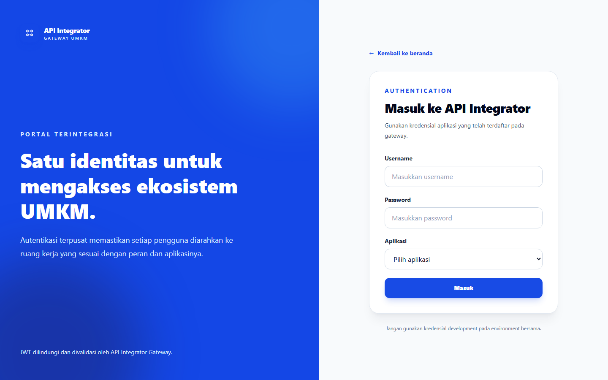
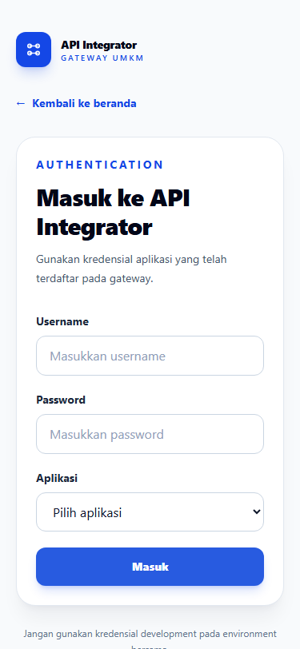
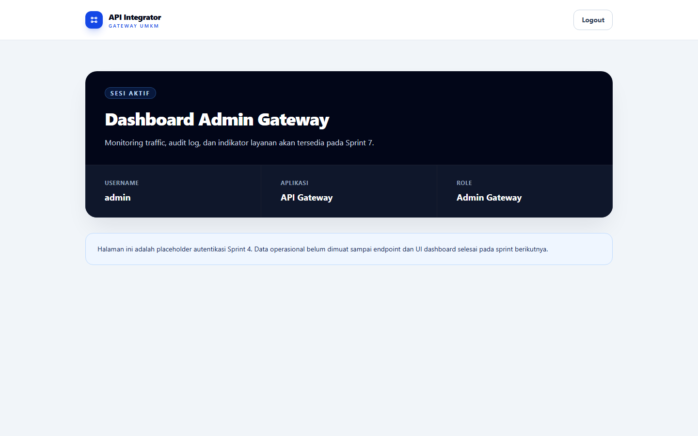

# Sprint 04 Report: Authentication System - Frontend

## Metadata

| Atribut | Nilai |
| --- | --- |
| Proyek | API Integrator Gateway |
| Sprint | Sprint 4 — Authentication System - Frontend |
| Tanggal laporan | 18 Juni 2026 |
| PIC | `venalism` |
| Commit implementasi | `daf59c2` |
| Status | Selesai |

## Ringkasan Eksekutif

Sprint 4 menghasilkan halaman login responsif, session management JWT,
interceptor Axios, pemulihan sesi melalui `GET /auth/me`, logout lokal, route
protection, dan pembatasan dashboard berdasarkan role. Landing page tetap
publik dan CTA login sekarang aktif.

Tiga route dashboard tersedia sebagai placeholder autentikasi:

- `/dashboard/admin` untuk `admin_gateway`
- `/dashboard/user` untuk `app_user`
- `/dashboard/monitoring` untuk `monitoring_user`

JWT menjadi satu-satunya data autentikasi yang disimpan pada `localStorage`
dengan key `access_token`. Dashboard operasional tetap berada dalam scope
Sprint 7 dan Sprint 8.

## Implementasi dan TDD

### RED

Test ditulis lebih dahulu untuk:

- Penyimpanan dan penghapusan token.
- Bearer interceptor serta penanganan response `401`.
- Form login dan tujuh pilihan aplikasi resmi.
- Login sukses, kredensial salah, dan kontrak response yang tidak konsisten.
- Pemulihan sesi setelah refresh dan token invalid.
- Protected route, role redirect, ketiga placeholder dashboard, dan logout.
- CTA landing untuk sesi anonymous maupun authenticated.
- Kontrak backend `login_status: "available"`.

Fase RED menghasilkan tiga frontend suite gagal karena modul auth belum tersedia.
Test server juga gagal dengan hasil `login status = "coming_soon", want
available`.

### GREEN

Implementasi minimum menambahkan:

- `react-router-dom` 7.18.0 dan Axios 1.18.0.
- Auth context dengan state `loading`, `anonymous`, dan `authenticated`.
- API client dengan request/response interceptor.
- Validasi allowlist pasangan role dan `dashboard_url`.
- Login page, protected route, dan placeholder dashboard.
- Pemulihan sesi melalui `/auth/me` serta penghapusan token saat `401`.
- Status login endpoint landing menjadi `available`.

### REFACTOR

- Landing page dipisahkan dari router utama.
- Token storage, role mapping, API client, auth context, guard, dan halaman
  ditempatkan pada modul terpisah.
- Hook auth dipisahkan dari provider agar Fast Refresh dan lint bersih.
- Brand mark mendukung warna inverse pada panel login.

## Verifikasi dan Acceptance Test

Quality gate final:

| Pemeriksaan | Hasil |
| --- | --- |
| Frontend test | 19 test lulus |
| Frontend lint | Lulus tanpa warning |
| Frontend production build | Lulus |
| Backend `go test ./...` | Seluruh package lulus |
| Backend race detector | Lulus menggunakan `golang:1.26.4-bookworm` |
| Backend vet dan build | Lulus |
| Migration integration test MySQL | Lulus |
| Docker Compose config dan build | Lulus |
| Healthcheck | MySQL, backend, dan frontend healthy |

Race detector dijalankan dalam container Go resmi karena host Windows tidak
memiliki compiler C `gcc` yang diperlukan oleh `go test -race`.

Smoke test API membuktikan login dan `/auth/me` berhasil untuk:

| Role | Aplikasi | Dashboard |
| --- | --- | --- |
| `admin_gateway` | API Gateway | `/dashboard/admin` |
| `app_user` | Marketplace | `/dashboard/user` |
| `monitoring_user` | UMKM Insight | `/dashboard/monitoring` |

Kredensial invalid menghasilkan `401`, dan `/landing` melaporkan
`login_status: "available"`.

Smoke test UI Microsoft Edge 149 headless membuktikan:

- Seluruh label terhubung ke input dan semua field wajib.
- Dropdown berisi tujuh aplikasi resmi.
- Login admin menuju dashboard yang benar.
- Hanya `access_token` yang tersimpan.
- Refresh mempertahankan sesi.
- Akses dashboard role lain diarahkan kembali ke dashboard admin.
- Logout menghapus token dan kembali ke login.
- Error kredensial ditampilkan secara generik.
- Viewport 375×812 tidak memiliki horizontal overflow.







## Docker dan Audit Versi

Perintah wajib berikut seluruhnya lulus:

```powershell
docker compose config --quiet
docker compose build --pull
docker compose up --detach
docker compose ps
```

Tidak ada backup database baru karena Sprint 4 tidak mengubah schema, image
MySQL, atau volume. Digest lokal `mysql:9.7` identik dengan manifest remote,
sehingga database tidak di-upgrade. Named volume `mysql_data` tidak dihapus
atau dibuat ulang.

| Komponen | Versi/hasil audit | Keputusan |
| --- | --- | --- |
| Docker Engine | Lokal 29.5.2; terbaru 29.5.3 | Host tidak di-upgrade otomatis karena dikelola Docker Desktop dan berada di luar perubahan repository. |
| Docker Compose | 5.1.4 | Sudah release terbaru. |
| Go build image | `golang:1.26.4-alpine3.24` | Dipertahankan; manifest resmi terbaru berhasil ditarik. |
| Backend runtime | Alpine 3.24.1 | Dipertahankan; manifest resmi terbaru berhasil ditarik. |
| Frontend image | `node:24-alpine3.24`, runtime 24.16.0 | Dipertahankan; Node 24.17.0 adalah LTS terbaru tetapi tag image `24.17.0-alpine3.24` belum tersedia. |
| Database | MySQL 9.7.1 | Dipertahankan; digest lokal dan remote sama. Perpindahan ke jalur 8.4 LTS merupakan migrasi mayor di luar scope sprint. |

Ukuran image setelah build:

- Backend: sekitar 8.59 MB.
- Frontend: sekitar 105.27 MB.
- MySQL: sekitar 270.19 MB.

Sumber audit:

- [Docker Engine 29 release notes](https://docs.docker.com/engine/release-notes/29/)
- [Docker Compose v5.1.4](https://github.com/docker/compose/releases/tag/v5.1.4)
- [Node.js release status](https://nodejs.org/en/about/previous-releases)
- [MySQL 9.7 release notes](https://dev.mysql.com/doc/relnotes/mysql/9.7/en/)
- Docker Official Image manifests untuk Go, Node.js, Alpine, dan MySQL.

## Acceptance Criteria

| Acceptance Criteria | Status | Bukti |
| --- | --- | --- |
| Kredensial valid dapat login | Lulus | Unit test dan smoke test tiga seed role. |
| Kredensial invalid menampilkan error | Lulus | UI menampilkan pesan generik dan API menghasilkan `401`. |
| Token tersimpan di `localStorage` | Lulus | Hanya key `access_token` yang tersimpan. |
| Refresh mempertahankan sesi valid | Lulus | `/auth/me` memulihkan dashboard admin. |
| Token invalid mengakhiri sesi | Lulus | Test menghapus token dan mengarahkan ke login. |
| Protected route dan role guard bekerja | Lulus | Route tanpa sesi ditolak dan role salah diarahkan kembali. |
| Logout menghapus token | Lulus | Smoke test menghasilkan token `null` dan path `/login`. |
| Landing page tetap publik | Lulus | Landing dapat dibuka tanpa token dan CTA login aktif. |
| Login responsif dan keyboard-accessible | Lulus | Label, required field, desktop, dan viewport mobile terverifikasi. |

## Risiko Tersisa dan Handoff

- JWT tetap berada di `localStorage` sesuai rencana proyek; penerapan produksi
  perlu mengevaluasi mitigasi XSS dan alternatif cookie `HttpOnly`.
- Logout tidak merevoke token server karena JWT masih stateless.
- Rate limiting login dan revocation list belum tersedia.
- Placeholder dashboard tidak mengambil data operasional sampai endpoint dan UI
  dashboard dikerjakan pada sprint berikutnya.
